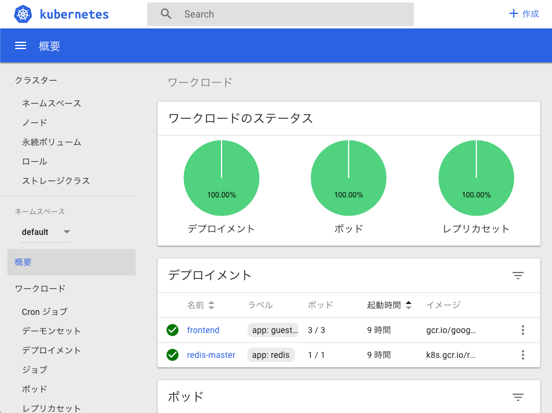
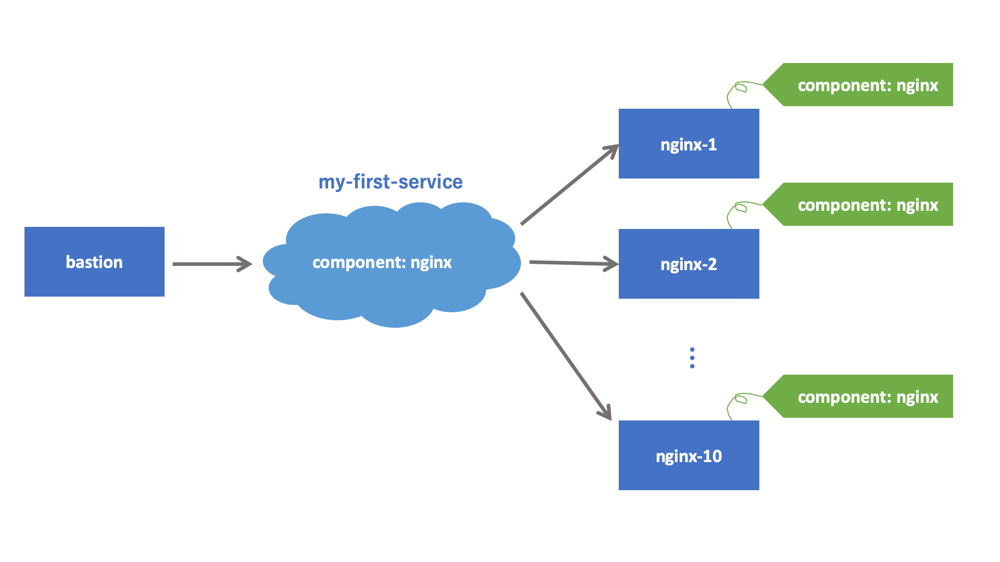
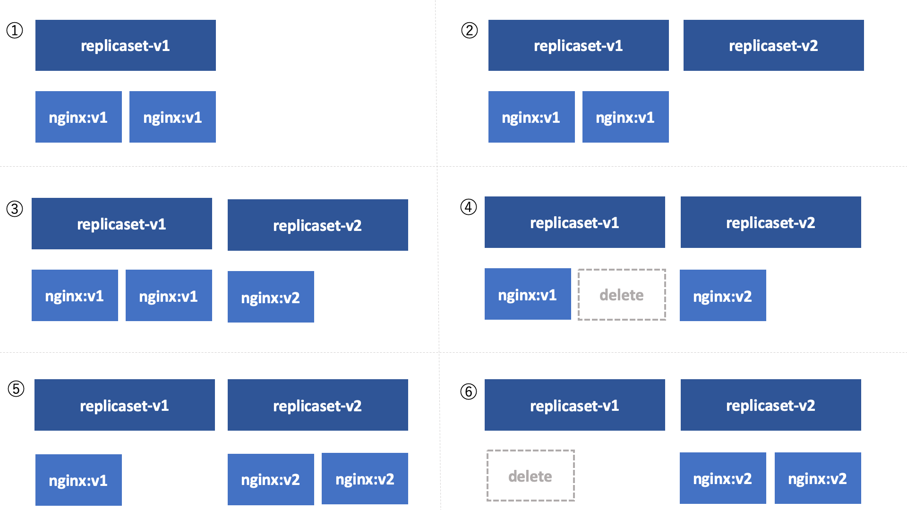
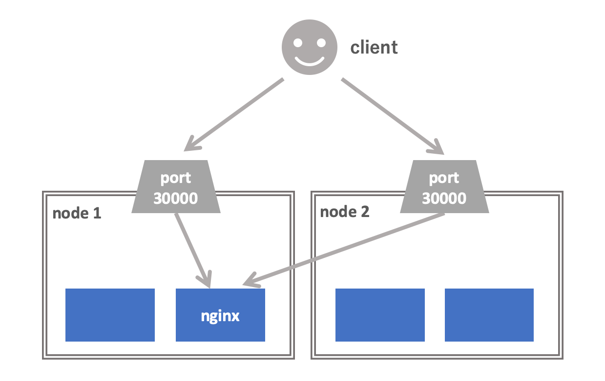

= Introduction to Kubernetes
:icons: font

== About

Kubernetes 入門へようこそ。

この文書は「Kubernetes という名前ぐらいは知っているけど、実際には使ったことがない、何ができるのかよく知らない」という人を対象に、Kubernetes の最も基本的なオブジェクトである Pod, Service, Deployment を解説します。この文書を読めば、Kubernetes 上に単純な Web アプリケーションをデプロイできるようになるはずです。

この文書は Docker コンテナの知識を仮定しています。Docker をよく知らない人は先に Docker について勉強しておくことをおすすめします。

この文書はアプリケーション開発者を主なターゲットとしています。Kubernetes クラスタの構築・運用については扱いません。

== なぜ Kubernetes を使うのか？

OS が提供する "仮想メモリ" という抽象化によって、ユーザーはプログラムの仕様を気にすることなくメモリを自由に増設できるし、開発者はユーザーの環境を気にすることなくプログラムを書くことができます。
OS という抽象レイヤーが存在することにより、ハードウェアとソフトウェアを独立して開発していくことができるわけです。

現在、我々のデータセンターではアプリケーションとサーバーを独立して開発・運用していくことが困難です。
アプリケーションを動かすためには、それが動作するサーバーのスペックやインストールされているソフトウェア、メンテナンスタイミングなどの知識が必要です。
逆に、サーバーはその上で走っているアプリケーションの知識なしにはセットアップもメンテナンスもできません。

Kubernetes は、データセンターのサーバー群を抽象化するレイヤーを提供します。
このレイヤーにより、OS がハードウェアとソフトウェアを疎結合にしたように、Kubernetes はアプリケーションとサーバーを疎結合にし、独立して開発・運用ができるようにしてくれます。
物理的なサーバーの代わりに Kubernetes の提供する抽象レイヤーに依存することによって、アプリケーションチームは物理サーバーの構成やメンテナンスを気にする必要がなくなるわけです。

注意してほしいのですが、Kubernetes を導入しても物理サーバーの障害やメンテナンスをなくすことはできません。
障害やメンテナンスによってアプリケーションに影響が生じうるという事実も変わりません。
じゃあ今までと何が違うのかというと、アプリケーションが障害・メンテナンスのハンドリングを Kubernetes の抽象レイヤーを通じて行えることです。
Kubernetes にはアプリケーションが障害から回復するために必要な道具がそろっているため、生で障害のハンドリングを行うよりもずっと楽ですし、サーバーの実装に直接依存しないのでサーバー側の変化にも影響されません。

== Kubernetes 環境を整える

ローカルに学習用の Kubernetes クラスタを立ち上げる場合は Minikube を使うのがおすすめです。

https://kubernetes.io/docs/tasks/tools/install-minikube/

Minikube をインストールしたら `minikube start` でシングルノードの Kubernetes クラスタが立ち上がります。

[NOTE]
====
Mac を使っている人は Docker for Mac に付属している Kubernetes を利用してもよいです。
Preference の Kubernetes タブから有効化できます。
====

=== Kubernetes のダッシュボードを表示する

Minikube には Kubernetes のダッシュボードがデフォルトでインストールされています。
Kubernetes クラスタの状況が GUI で確認できるので、立ち上げておくとよいでしょう。

....
$ minikube dashboard
....

== Kubernetes 上にコンテナをデプロイしてみる

Kubernetes にデプロイできる最小単位は **Pod** と呼ばれるオブジェクトです。
Pod はひとつ以上のコンテナをまとめたものです。
同じ Pod に属するコンテナは常に同じノードに配置されます。
また、同じ Pod に属するコンテナはホスト名やIPアドレスを共有します。
ファイルシステムはコンテナごとに別れていますが、ディレクトリを共有することもできます。

Kubernetes の概念を伝統的な環境のメタファーで考えると以下のような対応関係になります。

[width="50%"]
|===
| 伝統的な環境 | Kubernetes

| プロセス
| Container

| 仮想マシン
| Pod

| 実機
| Node

|===

コンテナは伝統的環境におけるプロセスに対応します。
コンテナを集めたものが Pod なので、Pod は仮想マシンのような立ち位置になります。
ただし、Pod のほうが仮想マシンよりもはるかに軽量です。
ノードは Pod をデプロイして動作させるための計算資源であり、伝統的環境における実機に対応します。
ただし、Kubernetes のノードは必ずしも実機である必要はなく、仮想マシンをノードとして使うこともできます。
実際、EKS や GKE では仮想マシンがノードとして用いられます。

それでは手元の Kubernetes クラスタにコンテナをデプロイしてみましょう。
以下の YAML ファイルを用意してください。

[source,yaml]
.nginx-pod.yaml
----
apiVersion: v1
kind: Pod
metadata:
  name: my-first-pod <1>
  labels:
    component: nginx <2>
spec:
  containers:
  - name: nginx <3>
    image: nginx:latest <4>
----

<1> Pod の名前。他の Pod と被ってはいけない
<2> ラベル。あとで説明します
<3> コンテナの名前。一つの Pod に複数のコンテナを含める場合はこの名前で区別する
<4> 実行する docker image。`docker run` に渡すイメージ名と同じものを指定する

YAMLファイルが準備できたら、Kubernetes にこのファイルを **apply** してみましょう。

....
$ kubectl apply -f nginx-pod.yaml
....

このコマンドを実行すると、Kubernetes クラスタの上で実際に Pod が作られ、実行されます。

`kubectl get pod` コマンドでクラスタ内の Pod の一覧を表示できます。
また、`kubectl describe pod [Pod名]` で Pod の詳細な情報を表示できます。
Pod にエラーが発生した場合、describe でエラーメッセージが見れる場合があるので、Pod のデプロイに失敗したときは describe するようにしましょう。

....
$ kubectl get pod
NAME           READY   STATUS    RESTARTS   AGE
my-first-pod   1/1     Running   0          16m

$ kubectl describe pod my-first-pod
Name:               my-first-pod
Namespace:          default
Priority:           0
PriorityClassName:  <none>
Node:               minikube/10.0.2.15
(中略)
Events:
  Type    Reason     Age   From               Message
  ----    ------     ----  ----               -------
  Normal  Scheduled  16m   default-scheduler  Successfully assigned default/my-first-pod to minikube
  Normal  Pulling    16m   kubelet, minikube  Pulling image "nginx:latest"
  Normal  Pulled     16m   kubelet, minikube  Successfully pulled image "nginx:latest"
  Normal  Created    16m   kubelet, minikube  Created container nginx
  Normal  Started    16m   kubelet, minikube  Started container nginx
....

Pod のデプロイに成功したら `kubectl exec` でコンテナの中に入ってみましょう。
curl で `localhost:80` にアクセスすると nginx が走っていることが確認できます。

....
$ kubectl exec -it my-first-pod -- bash
(my-first-pod)# apt update && apt install -y curl
(my-first-pod)# curl -i localhost:80
HTTP/1.1 200 OK
...
....

[NOTE]
====
Pod の IP アドレスに Kubernetes クラスタの外側からアクセスすることは通常できません。
(ただし、利用するネットワークプラグインによってはアクセスできます。例えば EKS では Pod の IP アドレスに同じ VPC 内からであればアクセス可能です)
====

== 他の Pod にアクセスする

Kubernetes で他の Pod にアクセスするためにはどうしたらよいでしょうか？

他の Pod にアクセスするための１つ目の方法は、Pod の IP アドレスを使うことです。
Pod は固有の IP アドレスを持っています。
Kubernetes クラスタの中からであれば、Pod の IP アドレスに対してアクセスすることが可能です。

実際にやってみましょう。

現在私たちのクラスタには nginx が１台あるだけなので、２台目の Pod をデプロイしましょう。
この Pod は bastion という名前の、ただ sleep するだけの Pod です。

[source,yaml]
.bastion.yaml
----
apiVersion: v1
kind: Pod
metadata:
  name: bastion
spec:
  containers:
  - name: bastion
    image: debian:stretch
    command: ["sleep", "infinity"]
----

....
$ kubectl apply -f bastion.yaml
....

デプロイできたら bastion から nginx にアクセスしてみましょう。
まず、nginx の IP アドレスを調べます。

....
$ kubectl get pod -o wide
NAME           READY   STATUS    RESTARTS   AGE    IP           NODE       NOMINATED NODE   READINESS GATES
bastion        1/1     Running   0          44s    172.17.0.6   minikube   <none>           <none>
my-first-pod   1/1     Running   0          115m   172.17.0.5   minikube   <none>           <none>
....

私の環境では `172.17.0.5` が nginx の IP アドレスのようです。
次に、bastion に `kubectl exec` で入って nginx に HTTP リクエストを投げてみましょう。

....
$ kubectl exec -it bastion -- bash
(bastion)# apt update && apt install -y curl
(bastion)# curl -i http://172.17.0.5/
HTTP/1.1 200 OK
...
....

無事に nginx にアクセスできたようです。

=== Service を使って他の Pod にアクセスする

前節で説明したように Kubernetes では Pod が IP アドレスを持っていて、他の Pod からその IP アドレスにアクセス可能です。
しかし、Pod の IP アドレスに対して通信を行うのはしばしば問題があります。

Kubernetes クラスタは動的な環境です。
バージョンアップによって Pod が再デプロイされたり、スケールアップ・スケールダウンによって Pod の数が増えたり減ったりします。
このときアプリケーションが Pod の IP アドレスに直接アクセスしていた場合、アクセス先の Pod が消滅していることがあります。
そのため、特定の Pod ではなく「所望の機能を提供する Pod のどれか」と通信するための安定した(=変化しない)エンドポイントが欲しくなります。

そこで、普通他の Pod との通信するときには **Service** というオブジェクトを使います。
Service を使うと「ある特定の Pod」ではなく「特定の **ラベル** を持つ Pod のどれか」にアクセスすることができます。

ラベルというのは、上の nginx の例だと `component: nginx` の部分です。
ここでの `component` や `nginx` が特別な意味を持っているわけではなく、利用者が好きな文字列を指定できます。
例えば `foobar: v2000` や `cybozu: kintone` もラベルとして valid です。 

Service はちょっと理解しにくい概念なので、詳しい説明より前にまず動作を見てみましょう。
以下が Service の定義の例です。

[source,yaml]
.nginx-service.yaml
----
apiVersion: v1
kind: Service
metadata:
  name: my-first-service
spec:
  selector: <1>
    component: nginx
  ports:
  - protocol: TCP
    port: 80
    targetPort: 80
----

<1> このセレクタに指定したラベルにマッチする Pod に Service へのアクセスが割り振られます

apply する方法は Pod と全く同じです：

....
$ kubectl apply -f nginx-service.yaml

# 確認
$ kubectl get service
....

さて、bastion に入って Service にアクセスできるか試してみましょう。
Service 名で指定した名前で nginx の Pod にアクセスできるようになっているはずです。

....
$ kubectl exec -it bastion -- bash
(bastion)# curl -i http://my-first-service/
HTTP/1.1 200 OK
...
....

この環境には `component: nginx` というラベルを持つ Pod は一つしかありませんが、仮にそのような Pod が10個あったとすると、`my-first-service` に対してTCPコネクションを張るたびに10個の Pod のうちのいずれかに繋がります。
つまり Service は TCP レベルのリバースプロキシのようなものと考えることができます。

ここで紹介した Service は Kubernetes クラスタ内部の Pod からしかアクセスできません。
クラスタ外部から Service の IP アドレスにアクセスしようとしても失敗します。
外部からアクセス可能な Service については後ほど説明します。

Service からリバプロされる Pod の集合は、その Service のラベルセレクタによって決まります。
ラベルセレクタに複数個のラベルを指定すると、それら全てのラベルを持つ Pod がセレクトされます。

Kubernetes におけるラベルは、キーと値の組です。
例えば、`my-first-pod` には `component: nginx` という一個のラベルが付与されています。
ラベルのキーと値には好きな文字列を指定できます。
ひとつの Pod に複数個のラベルを付与することも可能です。

== 同じ Pod をいくつも立てる

前の節では nginx を一台立ち上げました。
実際の運用環境では冗長性やスケーラビリティのために一つのサービスを複数台の Pod で構成することが一般的です。
ここでは Kubernetes の **ReplicaSet** というオブジェクトを利用して nginx を指定した台数だけ立ち上げてみましょう。

次の YAML を apply してみましょう。

[source,yaml]
.nginx-replicaset.yaml
----
apiVersion: apps/v1
kind: ReplicaSet
metadata:
  name: nginx-replicaset
  labels:
    component: nginx
spec:
  replicas: 3 <1>
  selector: <2>
    matchLabels:
      component: nginx
  template: <3>
    metadata:
      labels:
        component: nginx
    spec:
      containers:
      - name: nginx
        image: nginx:latest
----
<1> レプリカ数。この数だけ Pod を立てる
<2> ここに指定した条件に一致する Pod をこの ReplicaSet が管理する
<3> この ReplicaSet が作成する Pod の定義

....
# 現在の Pod の状態を確認
$ kubectl get pod

# ReplicaSet を作成
$ kubectl apply -f nginx-replicaset.yaml

# 確認
$ kubectl get replicaset
$ kubectl get pod
....

ReplicaSet は「`selector` にマッチする Pod の数」が「`replicas` に指定した数」になるように Pod を自動的にデプロイしたり削除したりするオブジェクトです。

この ReplicaSet が apply されたとき、`component: nginx` というラベルを持っていた Pod は `my-first-pod` ひとつだけでした。
`replicas` には３が指定してあるため、２つ足りません。
したがって、nginx が２つ追加でデプロイされます。

ReplicaSet によってデプロイされる Pod は `template` で指定された定義で作られます。
`template` の内容は Pod の YAML と同じ形式です。

ここで `my-first-pod` を削除してみましょう。何が起こるでしょうか？

....
$ kubectl delete pod my-first-pod
$ kubectl get pod
....

`my-first-pod` が削除されたことで、レプリカがひとつ足りない状態になりました。
そのことを Kubernetes が検知して自動的に nginx を追加でデプロイしました。

次に `nginx-replicaset.yaml` の `replicas` を 4 に書き換えて `kubectl apply` してみてください。
すると nginx の Pod が自動的にひとつ追加されます。
この状態でさらに `replicas` を 3 に書き換えて `kubectl apply` してみましょう。
すると nginx の Pod がひとつ削除されます。

このように ReplicaSet は定義されたレプリカ数と実際のレプリカ数が一致するように Pod をデプロイしたり削除したりしてくれます。

== ローリングアップデートする

現実のアプリケーションは一度デプロイして終わりではありません。
サービスを継続して改善していくために日常的に新しいバージョンをデプロイしていく必要があります。

アプリケーションを無停止で更新するにはどうしたらよいでしょうか？

無停止更新の実現手段としてよく利用されるのが **ローリングアップデート** です。

例えば３台の nginx があるとき、全ての nginx を同時に落とすとサービス断が発生してしまいます。
そこで、nginx を一台落として更新して立ち上げる、という作業を３回行います。
こうすると常に nginx が２台以上稼働している状況をキープできるため、サービス断が発生しません。

Kubernetes でローリングアップデートを行うには **Deployment** というオブジェクトを利用します。
Deployment は ReplicaSet と似たオブジェクトですが、ReplicaSet と違ってアップデートがサポートされています。
Deployment の動きは少し複雑なのでじっくり説明します。

更新前の nginx のバージョン(仮に v1 と呼びます)と更新後のバージョン(v2 と呼びます)があるとします。
Deployment を使わずに ReplicaSet でローリングアップデートを行う場合、手順はどうなるでしょうか？

. 初期状態として `nginx:v1` 用の ReplicaSet がデプロイされています。これを `replicaset-v1` と呼ぶことにします
. `nginx:v2` 用の ReplicaSet を `replicas: 0` として追加します。これを `replicaset-v2` と呼ぶことにします
. `replicaset-v2` の `replicas` を１増やします。すると `nginx:v2` がひとつ追加されます
. `replicaset-v1` の `replicas` を１減らします。すると `nginx:v1` がひとつ削除されます
. ３と４を必要な回数だけ繰り返します

Deployment を使うとこの作業を Kubernetes にやらせることができます。
それでは Deployment の使い方を見ていきましょう。

まず ReplicaSet があると紛らわしいので削除しておきます。

....
$ kubectl delete replicaset nginx-replicaset

# ReplicaSet を消すと Pod も自動的に削除される
$ kubectl get pod
....

Deployment の YAML は以下のようになります。ほとんど ReplicaSet と同じですね。

[source,yaml]
.nginx-deployment.yaml
----
apiVersion: apps/v1
kind: Deployment
metadata:
  name: nginx-deployment
  labels:
    component: nginx
spec:
  replicas: 3
  selector:
    matchLabels:
      component: nginx
  template:
    metadata:
      labels:
        component: nginx
    spec:
      containers:
      - name: nginx
        image: nginx:1.15
----

apply してみましょう。ReplicaSet のときと同様、nginx の Pod が３つデプロイされます。

....
$ kubectl apply -f nginx-deployment.yaml

# 確認（バージョンを確認するために IMAGE を表示するようにしています）
$ kubectl get pod -o 'custom-columns=NAME:.metadata.name,IMAGE:.spec.containers[*].image,PHASE:.status.phase'
....

それでは nginx のバージョンを更新してみましょう。

....
# `image: nginx:1.15` を `image: nginx:1.16` に書き換えてください
$ vim nginx-deployment.yaml

$ kubectl apply -f nginx-deployment.yaml

# 確認
$ kubectl get pod -o 'custom-columns=NAME:.metadata.name,IMAGE:.spec.containers[*].image,PHASE:.status.phase'
....

少し待つと全ての nginx の Pod が 1.16 に更新されたことが確認できると思います。

[NOTE]
====
上の例だとアップデートが無停止で行われているのかどうかがいまいちはっきりしません。
気になる人は以下の手順を試してみましょう。

. `nginx:1.15` をイメージに指定した Deployment を apply する
. 別のタブを開き、`bastion` のシェルの上で以下を流しておく:

    while true; do curl -s -i my-first-service | grep -E 'HTTP|Server'; sleep 0.1; done

. 元のタブに戻り、nginx のバージョンを `1.16` に書き換えて apply する

すると HTTP のアクセスが途切れることなく行われたまま nginx のバージョンが更新される様子が観測できると思います。

※ 厳密に言うと Pod が作成されてから nginx が起動完了するまでの間と Pod が削除されてから Service に反映されるまでの間に短いダウンタイムがあります。これを防ぐためには Readiness probe や preStop hook などが必要です。
====

Kubernetes を実際に利用する場合、Pod や ReplicaSet を直接作成することはほとんどありません。
Pod を作成するときは Deployment を使って作成することが大抵のケースでベストプラクティスです。

たとえ replica 数が１の場合でも Pod を作成する場合は Deployment を使って作るべきです。
単に Pod をひとつデプロイした場合、Pod が立っているノードが死ぬと Pod も道連れになってしまいます。

== サービスをクラスタの外部に公開する

Kubernetes 上にデプロイされたサービスを Kubernetes クラスタの外側に公開する方法を説明します。
クラスタ外にサービスを公開する方法はいくつかありますが、ここでは最も簡単な **NodePort** を使う方法を説明します。

[NOTE]
====
ローカルクラスタ構築ツールとして https://kind.sigs.k8s.io/[kind] を使っている場合、NodePort を使うには Docker のポートを localhost にマップする設定が必要です。 +
https://kind.sigs.k8s.io/docs/user/quick-start/#mapping-ports-to-the-host-machine
====

`nginx-service.yaml` を以下のように書き換えてください。

....
apiVersion: v1
kind: Service
metadata:
  name: my-first-service
spec:
  selector:
    component: nginx
  ports:
  - protocol: TCP
    port: 80
    targetPort: 80
    nodePort: 30000
  type: NodePort
....

`nodePort:` と `type:` の行が追加された行です。apply してみましょう。

....
$ kubectl apply -f nginx-service.yaml

# 確認
$ kubectl get service my-first-service
....

この作業によって、`my-first-service` の type が `ClusterIP` (デフォルト) から `NodePort` に変更されました。
Kubernetes クラスタの外側からこのサービスにアクセスしてみましょう。

....
# ノードのIPアドレスを取得する
# (minikube以外を使っている人はそれぞれのドキュメントを参照してノードのIPアドレスを取得してください)
$ minikube ip

# ブラウザで開く
$ open http://(IPアドレス):30000/
....

NodePort 型の Service を使うと、ノードの指定したポート経由でサービスにアクセスできるようになります。

クラスタにノードが複数台ある場合、どのノードにリクエストを投げてもよいです。
つまり、全てのノードで、指定したポートが指定したサービスにルーティングされるようになります。

== Pod をデバッグする

実際にはデプロイした Pod が一発で動作することは稀でしょう。多くの場合、デプロイした Pod をデバッグする必要があります。
すでに説明した `kubectl exec` や `kubectl describe` は Pod のデバッグに役立ちます。
この節では、この２つに加えてデバッグで便利な２つのコマンド `kubectl logs` と `kubectl port-forward` について説明します。

=== コンテナのログを見る

コンテナが標準出力・標準エラー出力に書き出したログは `kubectl logs` コマンドで確認できます。

....
$ kubectl logs nginx-deployment-6fb8fbbfc8-9nblk
172.17.0.6 - - [03/Jun/2019:09:52:42 +0000] "GET / HTTP/1.1" 200 612 "-" "curl/7.52.1" "-"
172.17.0.6 - - [03/Jun/2019:09:52:42 +0000] "GET / HTTP/1.1" 200 612 "-" "curl/7.52.1" "-"
....

また、`-f` オプションをつけると `tail -f` のように新しいログを逐次垂れ流してくれます。

複数のコンテナのログを一度に見たいときは `-l` オプションを使います。
`-l` は指定したラベルを持つコンテナのログを出力します。

....
$ kubectl logs -l component=nginx
....

=== ポートフォワードする

`kubectl port-forward` コマンドを使うと、Pod の特定のポートをローカルホストにポートフォワードすることができます。
これを使えばローカルの `curl` コマンドやブラウザから直接 Pod にアクセスできます。

例えば、以下のコマンドを実行するとローカルの `8080` をクラスタ内の nginx の `80` にフォワードしてくれます。

....
$ kubectl port-forward deployment/nginx-deployment 8080:80
....

この状態で `localhost:8080` をブラウザで開くと "Welcome to nginx!" が表示されます。

`kubectl port-forward` は Service とは異なり、接続先の Pod が死ぬと接続が切れます。
自動的に別の nginx に切り替わったりはしないため、もう一度コマンドを実行して接続を張り直す必要があります。
