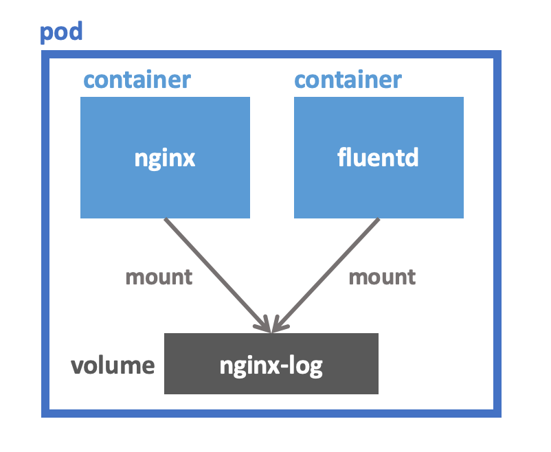
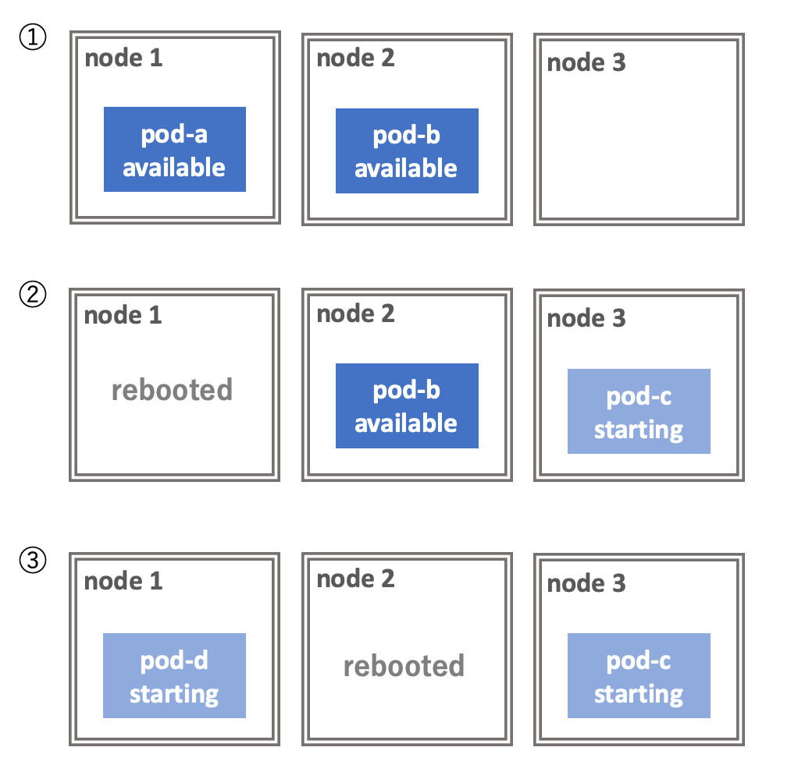

# More Introduction to Kubernetes
:icons: font

## ヘルスチェック

Pod は障害で応答不能な状態になったり、起動中でリクエストを処理できない状態であったりすることがあります。
Kubernetes は常に Pod の状態を監視しており、必要に応じて Pod を再起動したり Service のリバプロ先から除外したりします。
Kubernetes のヘルスチェックは以下の２つがあり、用途に応じて使い分けることができます。

* **Liveness probe** ― Pod が生きているか死んでいるかをチェックします。一定回数 Liveness probe が失敗した場合、Pod は再起動されます。
* **Readiness probe** ― Pod がリクエストに応答できるかどうかをチェックします。Readiness probe が成功するまでの間、その Pod は起動が完了していないとみなされ、Service のリバプロ先に追加されません。Readiness probe を使うことで Pod が起動が完了する前にリクエストが飛んでくる現象を防ぐことができます。

例:

[source,yaml]
----
apiVersion: v1
kind: Pod
metadata:
  name: liveness-http
spec:
  containers:
  - name: my-server
    image: my-server:1.2.3.4
    livenessProbe:
      httpGet:
        path: /v1/health
        port: 8080
      initialDelaySeconds: 3
      periodSeconds: 3
    readinessProbe:
      httpGet:
        path: /v1/ready
        port: 8080
      initialDelaySeconds: 3
      periodSeconds: 3
----

- レスポンスのステータスコードが 200 から 399 の間である場合は成功、そうでない場合は失敗とみなされます。
- HTTP リクエストを投げる方式、TCP コネクションを張る方式、Pod 内でコマンドを実行する方式があります。
- Readiness probe は Deployment がローリングアップデートするときの起動確認にも使われます。もし Readiness probe が Pod に設定されていない場合、Pod が立ち上がったらすぐにローリングアップデートが次の Pod に進んでしまいます。Pod が起動完了するより前に全ての Pod が更新されてしまうと障害となるため、Readiness probe は適切に設定する必要があります。

Liveness probe, Readiness probe は運用上非常に重要なため、常駐する Pod には必ず両方設定しておくようにしましょう。

## Resource Requests/Limits

**Resource Requests** は、コンテナが要求するメモリやCPUの量を宣言する機能で、Kubernetes のスケジューラは Resource Requests の値を見て Pod をデプロイするノードを決めます。

Pod が新しく作られるとき、Kubernetes はその Pod にノードを割り当てようとします。
各ノードには CPU とメモリのキャパシティが設定されています。
Kubernetes のスケージューラは、各ノードにデプロイされたコンテナの要求リソース量の合計がキャパシティを超えないようにノードを選びます。
スケジューラは各ノードの実際のCPU使用量やメモリ使用量を参照しないことに注意してください。

**Resource Limits** は、そのコンテナが実際に使用できるメモリやCPUの量の上限を設定する機能です。
コンテナが使用するメモリが設定された上限を超えた場合、そのコンテナは kill されます。
また CPU 使用量が上限に達した場合、このコンテナはスロットリングされます。

Resource Requests と Resource Limits は異なる値に設定できます。
Resource Requests < Resource Limits の場合、そのリソースはオーバーコミットされた状態になります。

例:

[source,yaml]
.nginx-pod.yaml
----
apiVersion: v1
kind: Pod
metadata:
  name: nginx
  labels:
    component: nginx
spec:
  containers:
  - name: nginx
    image: nginx:1.16
    resources:
      requests:
        memory: "128Mi"
        cpu: "250m"
      limits:
        memory: "128Mi"
        cpu: "500m"
----

APサーバーのように長時間動作するようなコンテナの場合、`requests` と `limits` を同じ値に設定し、オーバーコミットしないようにするのがよいでしょう。
Pod 内の全てのコンテナについて `requests` と `limits` の値が一致している場合、その Pod は **Guaranteed** Pod と呼ばれ、OOM killer に殺されにくくなります。

## Volume

Pod に複数のコンテナがあるとき、それらの間でローカルディレクトリを共有したいことがあります。
例えば、APサーバーが出力するログファイルをログ転送エージェントで転送するようなユースケースが挙げられます。

このような場合、Kubernetes では **Volume** という機能を使います。
Volume は他にも利用方法がありますが、この記事では上で挙げたユースケースに絞って解説します。

[source,yaml]
.nginx-pod.yaml
----
apiVersion: v1
kind: Pod
metadata:
  name: nginx
  labels:
    component: nginx
spec:
  containers:
  - name: nginx
    image: nginx:1.16
    volumeMounts: <1>
    - name: nginx-log
      mountPath: /var/log/nginx

  - name: fluentd
    image: my-fluentd:1.6.0.1
    volumeMounts: <2>
    - name: nginx-log
      mountPath: /var/log/nginx
      readOnly: true

  volumes: <3>
  - name: nginx-log
    emptyDir: {}
----

<1> `nginx-log` という名前の Volume を `/var/log/nginx` にマウントしています。
<2> ここでも `nginx-log` という Volume をマウントしています。こっちは `readOnly` にしてあります。
<3> `nginx-log` という Volume を `emptyDir` として定義しています。

`nginx-log` は `emptyDir` という種類の Volume です。
`emptyDir` Volume は Pod と同じノードに作られ、その Pod がそのノード上で生きている限り保持されます。
Pod が作成されたときは `emptyDir` Volume は空です。
Pod がそのノード上から削除されたら `emptyDir` Volume も一緒に削除されます。

`volumeMounts` はその名の通り Volume をコンテナのファイルシステム名前空間の中にマウントします。
上の例では `nginx-log` という Volume を `/var/log/nginx` にマウントしています。

## Anti Affinity

Deployment を使って同じ Pod を２つ作っているとします。
何も指定していないとその２つの Pod が同じノードにスケジュールされることがあります。
このような場合、そのノードが障害やメンテナンスなどで死亡すると２つの Pod が同時に消失してしまいます。

**Affinity** の機能を使えば Pod が異なるノードに配置されるようにスケジューラーに要求することができます。
Kubernetes の Affinity は非常に柔軟で様々なことができますが、ここでは上で挙げたユースケースに絞って説明します。

[source,yaml]
----
apiVersion: apps/v1
kind: Deployment
metadata:
  name: nginx-deployment
  labels:
    component: nginx
spec:
  replicas: 2
  selector:
    matchLabels:
      component: nginx
  template:
    metadata:
      labels:
        component: nginx
    spec:
      containers:
      - name: nginx
        image: nginx:1.16
      affinity: <1>
        podAntiAffinity:
          preferredDuringSchedulingIgnoredDuringExecution:
            - labelSelector:
                matchExpressions:
                  - key: "component"
                    operator: In
                    values:
                    - "nginx"
              topologyKey: "kubernetes.io/hostname"
----

<1> ここで Anti Affinity を設定しています。

この設定をしておくと、Kubernetes がこの Pod をデプロイするときに `component: nginx` というラベルを持つ Pod がいないノードにデプロイしようとします。
もしそのようなノードが存在しない場合は、Anti Affinity の設定を無視してデプロイします。

`preferredDuringSchedulingIgnoredDuringExecution` の代わりに `requiredDuringSchedulingIgnoredDuringExecution` を指定すると、Affinity の条件を満たせない場合に Pod がデプロイされません。
どうしても異なるノードにデプロイしたい場合はこちらを使うとよいでしょう。

[NOTE]
====
`podAntiAffinity` を巨大なクラスタ(数百ノード以上)で利用することは非推奨です。
このようなクラスタで `podAntiAffinity` を利用するとスケジューリングが顕著に遅くなります。
====

## Pod Disruption Budget

ノードの再起動が必要になる場合があります。
例えば Linux カーネルに脆弱性が発見された場合などです。

Pod を複数立てて冗長化しておけば、単一のノードのシャットダウンには耐えることができます。
しかし、ノードを次々と再起動していく状況では問題が起こることがあります。

次の図を見てください。
３台のノードからなるクラスタの上に２つの Pod がデプロイされています。
この2つの Pod は Deployment によりレプリカ数が２になるように設定されています。
このクラスタに対して、ノードを１台ずつローリングリブートしていきます。

１台目のノードをシャットダウンする過程で、その上で走っていた Pod が Evict されます。
Pod の数が減ったことを検知した Deployment が直ちに新しい Pod をデプロイします。
しかし、この Pod の起動には時間がかかるため、starting の状態で止まっています。
この状況で node 2 をシャットダウンすると、available な Pod が存在しなくなり、サービスが停止します。

これを防ぐには **Pod Disruption Budget** によってサービスの稼働に必要な Pod の数の最小値を指定しましょう。
PDB を指定すると、Kubernetes のツールがノードをシャットダウンする前にこの制約が満たされるように適切に待ってくれます。

[source,yaml]
.frontend-pdb.yaml
----
apiVersion: policy/v1beta1
kind: PodDisruptionBudget
metadata:
  name: frontend-pdb
spec:
  minAvailable: 1
  selector:
    matchLabels:
      app: guestbook
----

当然ですが、PDB の制約が守られるのはクラスタ管理者が意図してノードをシャットダウンする場合だけです。
障害でノードが死ぬ場合には PDB は無視されます。
また、Deployment を削除する場合も PDB は適用されません。

Pod が available かどうかの判定は Readiness probe によって行われます。PDB を正しく機能させるためには、Pod に適切な Readiness probe を設定しておく必要があります。
